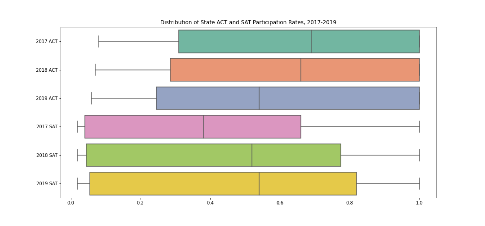
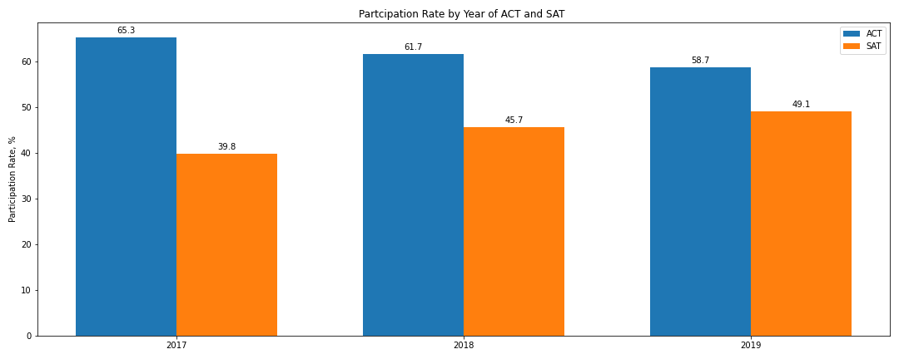

# ACT and SAT Participation Rate Analysis

## Problem Statement

This project aims to explore the trends in the SAT and ACT participation rates by state for the years 2017 - 2019 to identify those states with the lowest participation rates and make recommendations on what College Board can do to increase participation.

## Executive Summary

Before the new format of SAT was introduced in March 2016, the SAT was accused of being "class- biased". The "2400 version" of the test puts underprivileged students at an disadvantage. The tough vocabulary words, strange format of the math questions, and many stylistic elements of the test favored those who have the resources to prepare properly for the test. This resulted in ACT becoming more popular than SAT. [source](https://greentestprep.com/resources/sat-prep/new-sat-march2016/why-is-the-college-board-changing-the-sat/)

Working as a data scientist for College Board's Sales and Marketing Department, I am part of a team that analyzes statewide participation and make recommendations on where the money should be spent. This presentation and report is geared toward non-technical executives of the College Board. I will use the provided date to make recommendations on how College Board could do to increase the participation rates of those states that have the lowest participation rate.

## Data Import and Cleaning

- [2017 ACT](https://git.generalassemb.ly/schen325/dsir-111/blob/master/projects/project-01/data/act_2017.csv)
- [2018 ACT](https://git.generalassemb.ly/schen325/dsir-111/blob/master/projects/project-01/data/act_2018.csv)
- [2019 ACT](https://git.generalassemb.ly/schen325/dsir-111/blob/master/projects/project-01/data/act_2019.csv)
- [2017 SAT](https://git.generalassemb.ly/schen325/dsir-111/blob/master/projects/project-01/data/sat_2017.csv)
- [2018 SAT](https://git.generalassemb.ly/schen325/dsir-111/blob/master/projects/project-01/data/sat_2018.csv)
- [2019 SAT](https://git.generalassemb.ly/schen325/dsir-111/blob/master/projects/project-01/data/sat_2019.csv)

For the 2017 ACT, we have for each state along with national and District of Columbia, the participation rate (as a percentage), scores for English, Math, Reading, Science, and the Composite score (rounded to the nearest tenth).
For the 2018 and 2019 ACT, we have for each state including District of Columbia, the participation rate (as a percentage), and the Composite score (rounded to the nearest tenth).
For the 2017, 2018, 2019 SAT, we have for each state including District of Columbia, the participation rate (as a percentage), socres for Evidence- Based Reading and Rriting and Math, and the Total score (whole numbers).  

The final dataset is clean and complete. There is a total of 51 rows corresponding to the 50 states and the District of Columbia along with participation rate (converted percentage to numerical format ranging from 0.1 to 1.0) for SAT and ACT for years 2017, 2018, 2019. There are no missing values.  

## Dataset Dictionary for final.csv

|Feature|Type|Dataset|Description|
|---|---|---|---|
|state|object|ACT 2017|The name of each State including District of Columbia.|
|act_2017_participation_rate|float|ACT 2017|The percent of the state that participated in the 2017 ACT testing (units in percent, where 1.00 means 100%)|
|act_2018_participation_rate|float|ACT 2018|The percent of the state that participated in the 2018 ACT testing (units in percent, where 1.00 means 100%)|
|act_2019_participation_rate|float|ACT 2019|The percent of the state that participated in the 2019 ACT testing (units in percent, where 1.00 means 100%)|
|sat_2017_participation_rate|float|SAT 2017|The percent of the state that participated in the 2017 SAT testing (units in percent, where 1.00 means 100%)|
|sat_2018_participation_rate|float|SAT 2018|The percent of the state that participated in the 2018 SAT testing (units in percent, where 1.00 means 100%)|
|sat_2019_participation_rate|float|SAT 2019|The percent of the state that participated in the 2019 SAT testing (units in percent, where 1.00 means 100%)|

## Exploratory Data Analysis

Boxplot shows the distribution of participation rates for the years 2017 - 2019. This shows the minimum, maximum, medium, Q1 and Q3 percentile values.

Bar graph shows the average participation rates (%) of ACT and SAT each year. 

#### ACT 2017
17 states show 100% participation rate: Alabama, Arkansas, Colorado, Kentucky, Louisiana, Minnesota, Mississippi, Missouri, Montana, Nevada, North Carolina, Oklahoma, South Carolina, Tennessee, Utah, Wisconsin, Wyoming.
Maine at the lowest with 8%

#### ACT 2018
17 states show 100% participation rate: Alabama, Arkansas, Kentucky, Louisiana, Mississippi, Missouri, Montana, Nebraska, Nevada, North Carolina, Ohio, Oklahoma, South Carolina, Tennessee, Utah, Wisconsin, Wyoming.
Maine at the lowest with 7%

#### ACT 2019
15 states show 100% participation rate: Alabama, Arkansas, Kentucky, Louisiana, Mississippi, Montana, Nebraska, Nevada, North Carolina, Ohio, Oklahoma, Tennessee, Utah, Wisconsin, Wyoming.
Maine at the lowest with 6%

#### SAT 2017
4 states show 100% participation rate: Connecticut, Delaware, District of Columbia, Michigan.
3 states that have the lowest participation rate at 2%:  North Dakota, Mississippi, Iowa.

#### SAT 2018
5 states show 100% participation rate: Colorado, Connecticut, Delaware, Idaho, Michigan.
North Dakota at the lowest with 2%

#### SAT 2019
8 states show 100% participation rate: Colorado, Connecticut, Delaware, Florida, Idaho, Illinois, Michigan, Rhode Island
North Dakota at the lowest with 2%

#### Overall
ACT: There are 13 states that show commitment for the three years with 100% participation rate. They are: Alabama, Arkansas, Kentucky, Louisiana, Mississippi, Montana, Nevada, North Carolina, Oklahoma, Tennessee, Utah, Wisconsin, Wyoming

SAT: There are only 3 states that show commitment for the three year with 100% participation rate. They are: Connecticut, Delaware, Michigan

States that have >50% participation on both tests in 2017: Florida, Georgia, Hawaii

States that have >50% participation on both tests in 2018: Florida, Georgia, Hawaii, North Carolina, South Carolina

States that have >50% participation on both tests in 2019: Florida, Hawaii, North Carolina, South Carolina

States that have >50% participation on both tests from 2017- 2019: Florida and Hawaii

## Conclusions and Recommendations

After analyzing the SAT and ACT participation rate datasets, results show that the participation roughly mirrors each other. This means that states tend to prefer one test over the other. The ACT shows a larger group of commited states with 100% participation rate as well as higher baseline participation. The average participation rate for ACT 2017, 2018, 2019 are 65.3%, 61.7%, and 58.7%, respectively. The average participation rate for SAT 2017, 2018, 2019 are 39.8%, 45.7%, and 49.1%, respectively. 

SAT has a large group of participation rates less than 10%, a cluster of states with participation in the 50-80% range, and a small group of states with 100% participation. ACT, on the other hand, has almost no states with lower than 10% participation, and has a large group of states at 100% participation. 

There are a number of states that show less than 10% participation rate throughout the three years. Alabama, Arkansas, Iowa, Kansas, Kentucky, Louisiana, Minnesota, Mississippi, Missouri, Nebraska, North Dakota, South Dakota, Tennessee, Utah, Wisconsin, and Wyoming.

North Dakota is last with 2% participation rate for all three years. 

What can College Board do:

- Communicate with Board of Education to offer SAT prep courses in school 
- Offer free prep classes and free practice tests outside of school setting 
- Offer online resources 
- Offer free breakfast on the day of the test 

